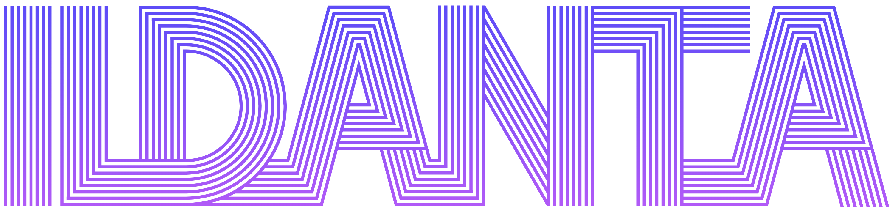
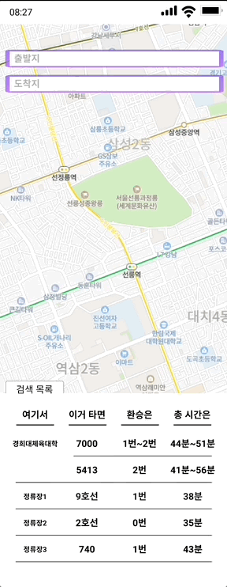

# ILDANTA

## Mock-up

## ToDo!!

- [x] MaxTransferNum, MinTransferNum 반영(21.11.30)
- [x] MaxTotalTime, MinTotalTime 반영(21.11.30)
- [x] Figma 참고해서 출력함수 생성(21.11.30)
- [x] 출력에서 '여기서' 통합, '이거타면' 통합.(21.12.01)
- [ ] Code Refactor
- [x] 현재 재귀적인 struct가 구현되지 않음. 재귀적으로 구현 (21.12.03)
- [ ] RestAPI 구조 개선 필요(body값을 넣고 읽어오는 것 구현하기)
- [ ] RestAPI의 재귀적 호출 구현
