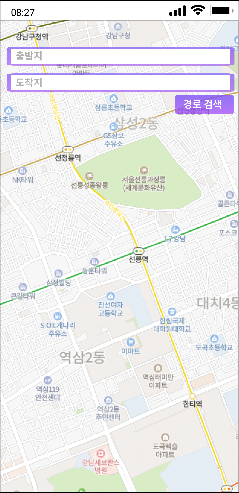
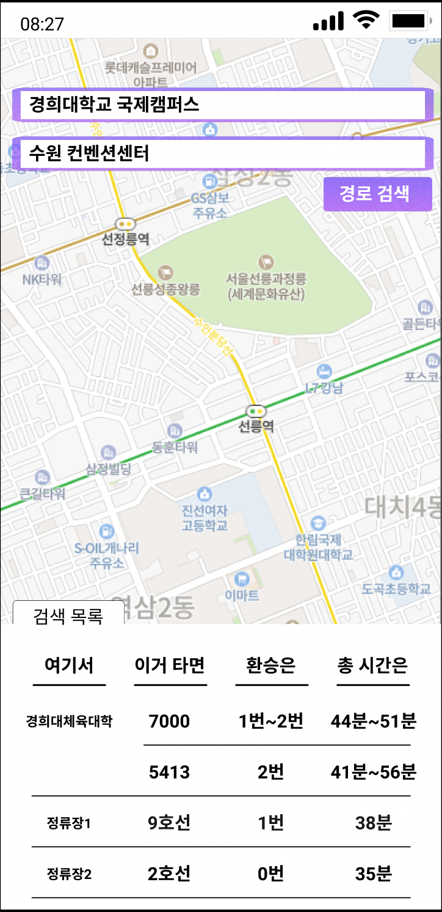
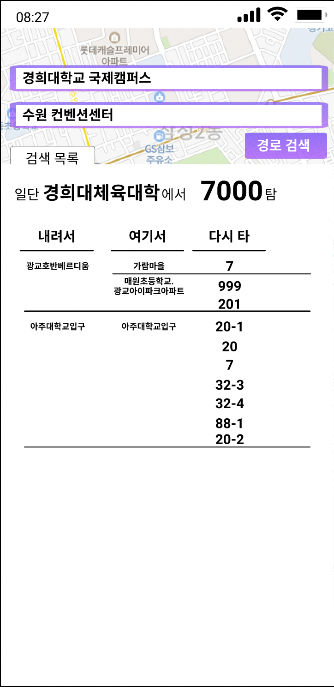
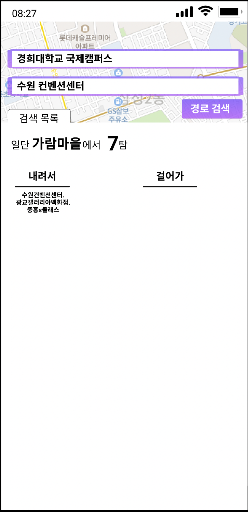

# ILDANTA

	
	
	
	
	 
    
  

급하게 대중교통을 탈 땐, 일단 타!

## Mock-up

## Flow Chart

## Service

**대중교통 길찾기 기능을 이용할 수 있고, 어떤 버스를 탄 이후의 환승정보를 보기 간편하게 출력해준다.**

예를 들어, 7000번을 이미 탔다면 7000번을 탄 후 어디서 내려서 어떤 버스로 환승하는 지를 보여준다.
| 메인화면 | 길찾기 | 경로 출력1 | 경로 출력2 |
| :--------------------------: | :-------------------------------: | :-------------------------------: | :-------------------------------: |
|  |  |  |  |

## RestAPI

##### [API REFERENCE 참조하기](./BE/README.md#api-reference)

- **Search** : [POST] /Search
- **Choose** : [POST] /Search/Choose

## ToDo!!

- [x] MaxTransferNum, MinTransferNum 반영(21.11.30)
- [x] MaxTotalTime, MinTotalTime 반영(21.11.30)
- [x] Figma 참고해서 출력함수 생성(21.11.30)
- [x] 출력에서 '여기서' 통합, '이거타면' 통합.(21.12.01)
- [x] Code Refactor(22.05.30 - 아직 부족)
- [ ] Code Refactor More
- [x] 현재 재귀적인 struct가 구현되지 않음. 재귀적으로 구현 (21.12.03)
- [x] RestAPI 구조 개선 필요(body값을 넣고 읽어오는 것 구현하기)(22.05.28)
- [x] RestAPI의 재귀적 호출 구현(22.05.30 - 굳이 구현할 필요 없을 것으로 예상)

- [ ] 현재 데이터가 [ODsay => ResultDomain => restDomain] 순으로 정제됨. 이를 단순화? 시키면 좋을지
- [ ] DB연결
- [ ] FirstRoute와 SubRoute의 rest API response 값이 다른데 이를 통일 시킬 필요가 있을까?
